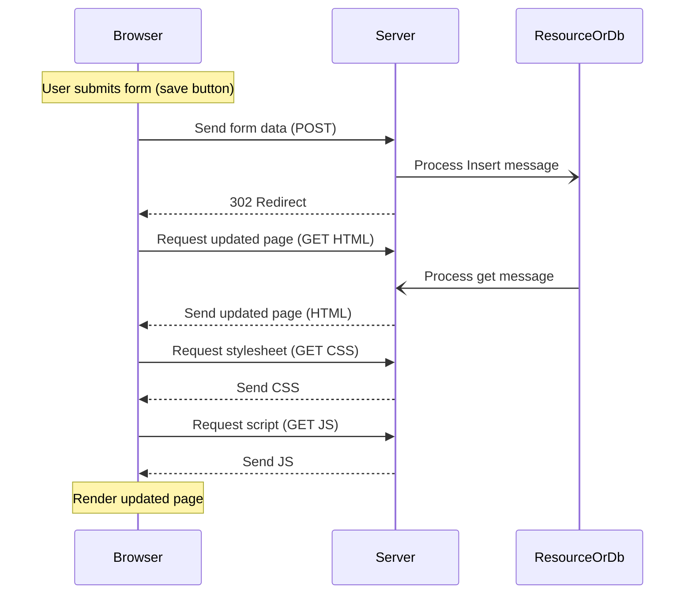
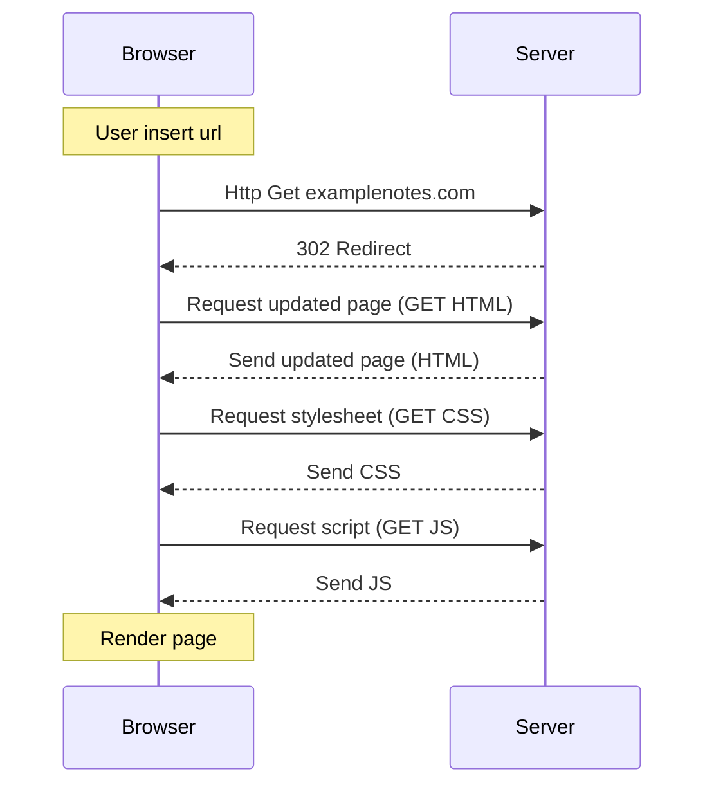
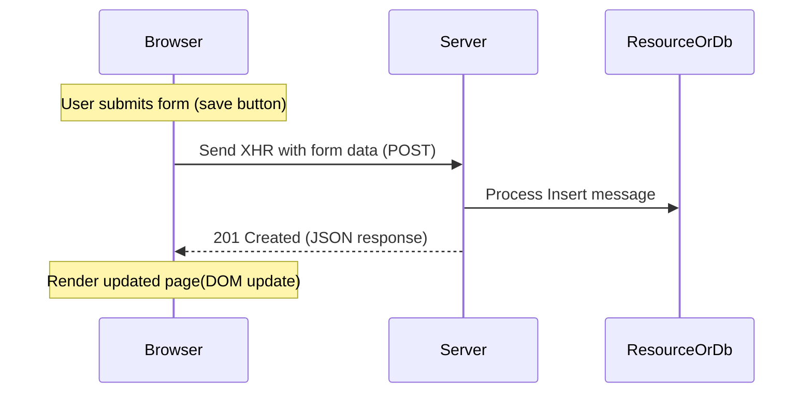

## 0.4 Note Diagram

```mermaid
sequenceDiagram
    participant Browser
    participant Server
    participant ResourceOrDb

	Note over Browser: User submits form (save button)
    Browser->>Server: Send form data (POST)
    Server-)ResourceOrDb: Process Insert message
    Server-->>Browser: 302 Redirect
    Browser->>Server: Request updated page (GET HTML)
    ResourceOrDb-)Server: Process get message
    Server-->>Browser: Send updated page (HTML)

    Browser->>Server: Request stylesheet (GET CSS)
    Server-->>Browser: Send CSS

    Browser->>Server: Request script (GET JS)
    Server-->>Browser: Send JS
	Note over Browser: Render updated page
```

## 0.5 SPA Get Page Diagram

```mermaid
sequenceDiagram
    participant Browser
    participant Server

	Note over Browser: User insert url
    Browser->>Server: Http Get examplenotes.com
    Server-->>Browser: 302 Redirect
    Browser->>Server: Request updated page (GET HTML)
    Server-->>Browser: Send updated page (HTML)
    Browser->>Server: Request stylesheet (GET CSS)
    Server-->>Browser: Send CSS
    Browser->>Server: Request script (GET JS)
    Server-->>Browser: Send JS
    Note over Browser: Render page
```

## 0.6 SPA Note Diagram

```mermaid
sequenceDiagram
    participant Browser
    participant Server
    participant ResourceOrDb

    Note over Browser: User submits form (save button)
    Browser->>Server: Send XHR with form data (POST)
    Server->>ResourceOrDb: Process Insert message
    Server-->>Browser: 201 Created (JSON response)
    Note over Browser: Render updated page(DOM update)
```
